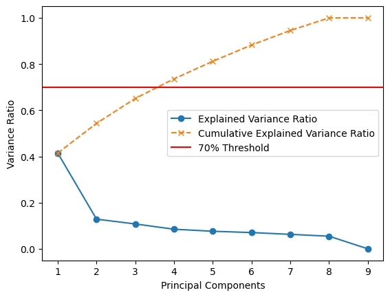
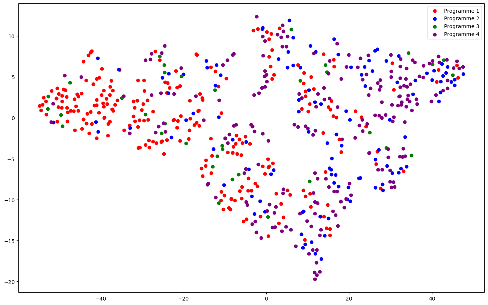
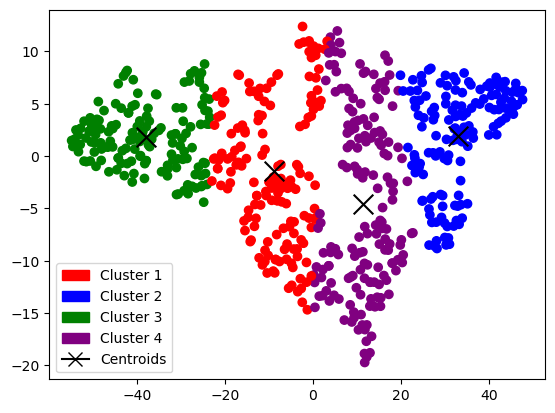

# Student Programme Classification using ML

This repository documents a comprehensive, multi-stage data science project exploring a student performance dataset. The project covers data preprocessing, feature engineering, supervised classification, and unsupervised clustering, with the primary goal of classifying students into their respective academic programmes. All analyses and visualizations were performed using Python and its data science ecosystem.

The project is structured into three main parts, corresponding to the three courseworks.

---

## Table of Contents
1.  [**Coursework 1: Data Preprocessing & Feature Engineering with PCA**](#coursework-1-data-preprocessing--feature-engineering-with-pca)
    *   Data Observation & Normalization
    *   Dimensionality Reduction with PCA
    *   Feature Contribution Analysis
2.  [**Coursework 2: Supervised Learning for Student Classification**](#coursework-2-supervised-learning-for-student-classification)
    *   Feature Importance Analysis
    *   Decision Tree Classifier
    *   Random Forest Classifier
    *   Support Vector Machine (SVM) with PCA
    *   Ensemble Classifier (Stacking)
3.  [**Coursework 3: Unsupervised Clustering Analysis**](#coursework-3-unsupervised-clustering-analysis)
    *   Dimensionality Reduction with t-SNE
    *   Gaussian Mixture Model (GMM)
    *   K-Means Clustering
    *   Hierarchical Clustering
    *   Evaluation of Clustering Results

---

## Coursework 1: Data Preprocessing & Feature Engineering with PCA

The first part of the project focused on understanding the raw dataset, cleaning and normalizing it, and then applying Principal Component Analysis (PCA) for dimensionality reduction and feature extraction.

### Data Observation & Normalization

The initial 11-dimensional dataset contained features with vastly different scales. A box plot of the raw data (excluding non-statistical columns) revealed that features like `Total` and `MCQ` scores dominated the scale, compressing other features.

To address this, Min-Max normalization was applied. The effect is clearly visible in the box plot of the normalized data, where all features are scaled to a common range, making them comparable.

  
   
  <em><b>Figure 1:</b> Boxplot of selected features after Min-Max normalization.</em>

### Dimensionality Reduction with PCA

PCA was used to reduce the dataset's dimensionality while retaining as much variance as possible. By analyzing the cumulative explained variance, it was determined that the first **four principal components** capture over 70% of the total variance in the data.

  
   
  <em><b>Figure 2:</b> Cumulative explained variance by principal components. The first four components were selected.</em>

Visualizing the data using the first two principal components shows some separation between student `Programme` groups, particularly for Programme 3 (green).

  
   
  <em><b>Figure 3:</b> 2D visualization of the data using the first two principal components.</em>

### Feature Contribution Analysis

To understand which original features were most influential, a correlation heatmap and a feature contribution plot were generated. Both analyses consistently highlighted that `Total`, `MCQ`, `Q2`, and `Q4` scores are the most significant contributors to the principal components.

  
   
  <em><b>Figure 4:</b> Top 1 principal component's feature contributions, confirming the importance of `Total` and `MCQ`.</em>

---

## Coursework 2: Supervised Learning for Student Classification

The second part of the project aimed to classify students into their respective `Programme` using various supervised learning models.

### Feature Importance Analysis

Before building the models, an analysis of Entropy, Information Gain, and Gini Impurity was conducted to identify the most informative features for classification. This confirmed that `Total`, `Grade`, `MCQ`, and `Q2` are strong candidates for building effective classifiers.

  
   
  <em><b>Figure 5:</b> Entropy, Information Gain, and Gini Impurity for each feature.</em>

### Model Performance Comparison

Several classifiers were trained and evaluated based on their F1 score over 10 repeated trials.

*   **Decision Tree**: Achieved an average F1 score of **0.57**. The performance was somewhat unstable across different random splits of the data.
*   **Random Forest**: Showed improved stability and a higher average F1 score of **0.61**, demonstrating the benefits of an ensemble approach.
*   **SVM with PCA**: After reducing dimensionality with PCA, the SVM classifier achieved an average F1 score of **0.55**.
*   **Ensemble (Stacking) Classifier**: A stacking model, which uses the predictions of the other classifiers as input, achieved the **highest average F1 score**, outperforming all individual models.

  
   
  <em><b>Figure 6:</b> F1 score comparison across 10 iterations and the average F1 score for each classifier. The ensemble model consistently performed best.</em>

---

## Coursework 3: Unsupervised Clustering Analysis

The final part of the project explored the dataset using unsupervised learning to see if natural groupings in the data correspond to the student `Programme` labels.

### Dimensionality Reduction with t-SNE

To facilitate visualization and clustering, the high-dimensional data was first reduced to two dimensions using **t-SNE (t-Distributed Stochastic Neighbor Embedding)**.

  
   
  <em><b>Figure 7:</b> 2D visualization of the student data after t-SNE reduction.</em>

### Clustering Algorithms & Evaluation

Three different clustering algorithms were applied to the t-SNE-reduced data. The goal was to create 4 clusters, corresponding to the 4 student programmes.

**1. Gaussian Mixture Model (GMM)**
The optimal number of clusters was initially explored using BIC and AIC scores. While the scores suggested 7 clusters, the analysis proceeded with 4 clusters as required. The GMM achieved an average silhouette coefficient of **0.34**.

  
   
  <em><b>Figure 8:</b> BIC and AIC scores for GMM, suggesting an optimal cluster count different from 4.</em>

**2. K-Means Clustering**
The elbow method and silhouette scores were used to evaluate the optimal `k`. K-Means produced the best-defined clusters, achieving the highest average silhouette coefficient of **0.45**.

  
   
  <em><b>Figure 9:</b> Clusters identified by the K-Means algorithm.</em>

**3. Hierarchical Clustering**
Agglomerative hierarchical clustering was performed, resulting in a silhouette coefficient of **0.44**. The resulting dendrogram showed how data points were progressively merged into clusters.

### Evaluation of Clustering Results

Despite successfully implementing the clustering algorithms, the final analysis revealed **little to no correlation** between the generated clusters and the actual student `Programme` affiliations.

*   Each cluster contained students from all four programmes.
*   The distribution of programmes within each cluster was relatively uniform.
*   Pearson correlation coefficients between cluster assignments and programme labels were very low (ranging from -0.23 to 0.29).

This suggests that the features in the dataset, even after dimensionality reduction, are not sufficient to naturally separate students based on their programme through unsupervised methods alone.

  
   
  <em><b>Figure 10:</b> Stacked bar chart showing the distribution of the four programmes within each of the four K-Means clusters, illustrating the lack of clear separation.</em>

